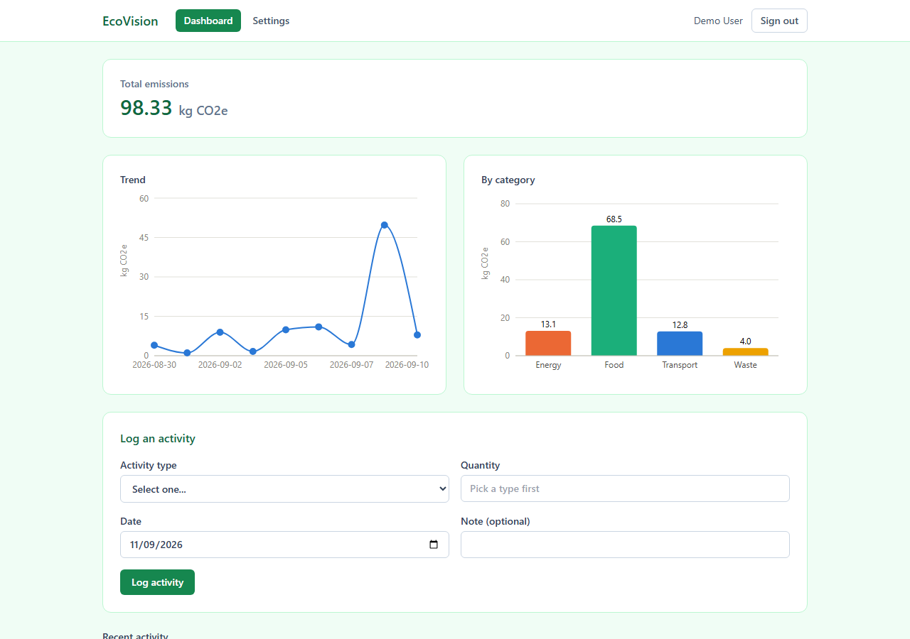

# EcoVision

[](https://github.com/MariusReik/EcoVision/actions/workflows/ci.yml)

A carbon footprint tracker. Log a transport, energy, food, or waste activity and the
server calculates its emissions once, using a real, cited, region-aware conversion
factor — never a client-supplied number, never recomputed later.

This is a from-scratch rebuild of an earlier Vue/Express prototype. The old version
grew carbon-offset integrations, achievements, and a leaderboard before the core
tracking loop even worked; this rebuild deliberately keeps scope to what's in
ARCHITECTURE.md section 2.



## What it actually does

- Register and log in (JWT, BCrypt password hashing).
- Log an activity — car trip, electricity/gas usage, a meal, waste disposal — as a
  quantity and a date. The server resolves the correct emission factor for your
  region (falling back to a global average when no region-specific factor exists)
  and stores the computed `emissions_kg` alongside the exact factor used, so every
  entry is auditable after the fact.
- Browse your activity history (cursor-paginated) and delete entries.
- A dashboard: total emissions over a date range, a breakdown by category, and a
  daily trend chart.
- Per-user settings: display name, region, and — for electricity specifically —
  whether to account on a location basis (physical grid mix) or market basis
  (residual mix after tradable guarantees of origin are sold, see below).

## What it doesn't do

No carbon offsets, no achievements, no leaderboard, no stored/generic
recommendations, no social features. These were explicitly cut from scope; see
ARCHITECTURE.md's hard rules before proposing any of them back in.

## The emission factors are real

Every row in `emission_factor` cites a real, dated, published source — no number in
this dataset was invented. Currently seeded ([V3 migration](backend/src/main/resources/db/migration/V3__seed_reference_data.sql)):

- **DESNZ (UK) 2024 GHG Conversion Factors for Company Reporting** — cars, bus,
  rail, short-haul flights, natural gas, UK grid electricity, landfill waste.
- **Poore & Nemecek (2018), *Science*** — beef, chicken, pork, milk, rice, via
  Our World in Data's summary of the ~38,700-farm dataset.
- **NVE (Norway), 2024** — Norway's physical electricity production mix
  (11.9 g CO2e/kWh — hydro/wind-dominated, so dramatically lower than most grids).

**Known gap:** Norway's *market-based* electricity factor (the residual mix reported
in NVE's *varedeklarasjon*, relevant once a supplier's guarantees of origin are sold
abroad) is not yet seeded. Secondary sources disagreed by more than 100 g CO2e/kWh
and none could be confirmed directly against an NVE-published figure, so — per this
project's rule against guessing factors — it was left out rather than estimated.
Practically: selecting "Market-based" accounting for a Norway account will 422 with
`no-applicable-emission-factor` on electricity specifically, until that figure is
sourced from NVE's *strømdeklarasjoner* factor sheet.

Every other region falls back to the GLOBAL factor for activity types that don't yet
have a region-specific override — this is correct, documented behavior (see
ARCHITECTURE.md section 5), not a bug.

## Tech stack

**Backend:** Java 21, Spring Boot 3, Spring Data JPA, Spring Security (JWT resource
server), PostgreSQL 16, Flyway, Gradle (Kotlin DSL), JUnit 5 + Testcontainers.

**Frontend:** TypeScript, React 19, Vite, TanStack Query, React Router, Tailwind
CSS v4, Recharts.

## Running it locally

```bash
docker compose up -d              # Postgres on :5432

cd backend
export JWT_SECRET=$(openssl rand -base64 32)
./gradlew bootRun                 # backend on :8080, runs Flyway migrations on boot

cd ../frontend
npm install
npm run dev                       # frontend on :5173
```

Then open http://localhost:5173, register an account, and log an activity — or skip
registration and use the demo account below.

### Demo account

```bash
node scripts/seed-demo-account.mjs
```

Creates (or reuses) `demo@ecovision.app` / `DemoPass123!` with about ten activities
spread over the last couple of weeks, so the dashboard has something to show
immediately. Requires the backend to already be running.

### API docs

With the backend running: interactive Swagger UI at
http://localhost:8080/swagger-ui.html, raw OpenAPI JSON at
http://localhost:8080/v3/api-docs. Every endpoint under `/api` except
`/api/auth/register` and `/api/auth/login` requires a bearer token from the login
response.

### Tests

```bash
cd backend
./gradlew test                    # unit + Testcontainers integration tests; requires Docker running
```

## Known gaps

- Norway market-basis electricity factor — see above.
- Region-specific factors exist for the UK (via DESNZ) and Norway (via NVE) only;
  every other listed region currently resolves to the GLOBAL average.
